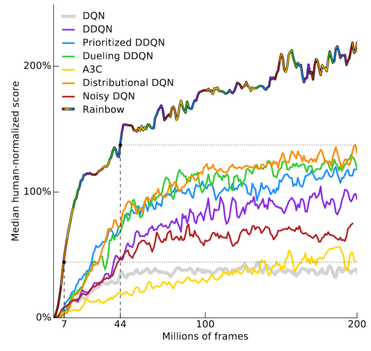

# [Rainbow: Combining Improvements in Deep Reinforcement Learning](https://arxiv.org/pdf/1710.02298.pdf)

Understanding note : **6**

**TLDR** :

- Several independent improvements of Deep Q-Network (DQN) algorithm.
- This paper proposes an agent that combined some improvement of DQN algorithm
- Provide state-of-art performance on the Atari 2600 Benchmark

---

**Key points** :

- Rainbow is a combination of **6** independent improvement.
- Double Q-Learning : The estimated value of the discounted future is evaluated using a different policy, which solves the **overestimation issue**.
- Prioritized replay : Improves data efficiency, by replaying more often transitions from which there is **more to learn**.
- Dueling networks : Helps to generalize across actions by **separately** representing state values and action advantages.
- Multi-step learning : Shifts the bias-variance tradeoff and helps to propagate newly observed rewards faster to earlier visited states.
- Distributional RL : Learns a **categorical distribution** of discounted returns, instead of estimating the mean.
- Noisy net : uses stochastic network layers for **exploration**.
- Rainbow variants prioritize transitions by the Kullback–Leibler loss
- **Prioritized replay** and **multi-step** learning are the most crucial components of Rainbow
- Rainbow improve the **learning speed**

---
**My impression** :
- Before reading this paper I thought the policy gradient was better than the Q-learning methods... I changed my mind a lot. 
- Implementation of Rainbow available in [Dopamine](https://github.com/google/dopamine) framework